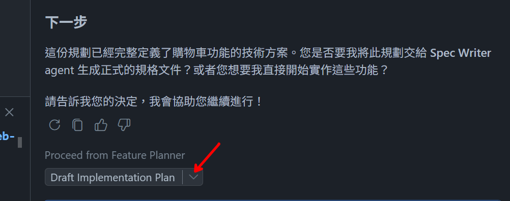

# 🚀 GitHub Copilot Hands-on Lab
## 🛠️ 開發工具中的 GitHub Copilot Workshop
- 模型選擇建議: **Claude Sonnet 4.5**

### ✨ 透過 Custom Agent 套用於不同操作情境
#### **提示詞優化** : 利用 Refine Prompt agent 進行提示詞優化
- **示範重點：** 使用專屬 agent 來改進提示，並提供清晰度評分
- **目的：** 幫助使用者釐清提示是取得好結果的關鍵，而多數開發者不知道如何改善提示此自訂聊天模式可協助提升提示品質
- **操作方式：**
    1. 在 Chat 模式選擇 **RefinePrompt**
    2. 輸入模糊的提示：`我需要購物車頁面` 輸出應包含追問與低清晰度分數
    3. 將 [cart image](../docs/design/cart.png) 附加到 Chat
    4. 輸入較完整的提示
       ```
       我需要購物車頁面，依附圖的設計元素顯示目前購物車內的商品，並支援深色/淺色模式。
       顯示 25 美元的運費，但當訂單金額超過 150 美元時提供免運費。
       在導覽列新增購物車圖示，能即時顯示購物車內的商品數量並於新增或移除商品時更新，點擊圖示時導向購物車頁面。
       ```
    6. 你應可看到更佳的提示與較高的清晰度評分

#### **程式碼修復** : 修復程式碼功能面向錯誤
- **示範重點：** 利用 Copilot 的 custom agent 協助修復程式碼
- **目的：** 利用 Copilot 的 Debug Mode Instructions 模式協助修復程式碼問題
- **操作方式：**  
  1. 開啟 Copilot Chat，切換至 `Debug Mode Instructions` 模式
  2. 輸入 `目前使用者創建帳號可選擇未來日期，進行修復`，查看 Copilot 生成的修復建議及改善

#### **安全性審查** : 利用 custom agent 進行安全性審查並產生修復計畫
- **示範重點：** 示範如何使用自訂 Agent 進行安全性審查並產生修復計畫
- **目的：** 展現如何使用自訂 Agent 進行安全性審查，並根據審查結果產生具體的修復計畫
- **操作方式：**
  1. 開啟 Copilot Chat，切換至 `Agent` 模式，選擇 `SE: Security` Agent
  2. 請 Copilot `#codebase 分析並檢查是否存在明顯的安全性弱點`
  3. 完成後會出現 `Begin drafting plan to Fix Security Issues` 的 handoff，點選後會看到 Copilot 根據審查結果產生的修復計畫，包含優先級分類和具體的程式碼修改建議

---


### 🛠️ 製作自己的第一隻 Custom Agent
- **示範重點：** 示範如何實作一隻簡單的 Custom Agent
- **目的：** 讓使用者了解 Custom Agent 的基本架構與實作
- **操作方式：**
  1. 開啟 Copilot Chat，切換至 `Agent` 模式，輸入以下提示詞
      ```
         /create-agent Test Data Builder Generator
      ```
  2. 根據 Copilot 的提示，明確具體需求
      ```
      1. 兩者都支援
      2. 基於現有的 models（Product, Order, Branch 等）生成測試資料
      3. 包含生成實際的測試資料 JSON/YAML 檔案並能執行終端命令來驗證
      4. 存放於 agents
      ```
  3. 輸入 prompt，測試 agent 是否能根據需求產出測試資料
      ```
      生成 product 測試資料
      ```

---

### 🎯 使用 Handoff 機制串連 Agent

- **示範重點：** 示範如何實作具有 handoff 的 Custom Agent
- **目的：** 讓使用者了解 Custom Agent 的基本架構與實作
- **操作方式：**
  1. 開啟 Copilot Chat，切換至 `Agent` 模式，輸入以下提示詞
    ```
    /create-agent 建立一個提供開發者做功能開發前的規畫 agent，此 agent 完成規劃後會v hand-off 給使用者一個實作計畫的草稿，讓使用者可以將此草稿進行修改後交給實作 agent 進行開發
    ```
  2. 調整 handoffs 內文
    ```
      handoffs:
      - label: Draft Implementation Plan
        agent: agent
        prompt: '#createFile the plan as is into an untitled file (`untitled:plan-${camelCaseName}.prompt.md` without frontmatter) for further refinement.'
    ```
  3. 輸入 prompt，測試 agent 是否能根據需求產出實作計畫草稿
    ```
    我需要購物車頁面，依附圖的設計元素顯示目前購物車內的商品，並支援深色/淺色模式。

    顯示 25 美元的運費，但當訂單金額超過 150 美元時提供免運費。
    在導覽列新增購物車圖示，能即時顯示購物車內的商品數量並於新增或移除商品時更新，點擊圖示時導向購物車頁面。
    ```
  4. 點選 `Draft Implementation Plan` 的 handoff，確認產出的實作計畫草稿內容是否符合預期
  

---

### ⚙️ 使用 Skill 來自動化特定任務
- **注意：** 此 Lab 會需要於本機端安裝相關套件來展示 skill 功能，以便執行自動化腳本，如無法安裝則無須進行此 lab
- **示範重點：** 示範如何使用 Skill 來完成報告產出
- **目的：** 讓使用者了解 Skill 的使用及運作
- **操作方式：**
  1. 開啟 Copilot Chat，切換至 `Agent` 模式，輸入以下提示詞
     ```
      /pptx 分析 #codebase ，生成 ppt 說明目前專案的主要功能及採用技術
     ```